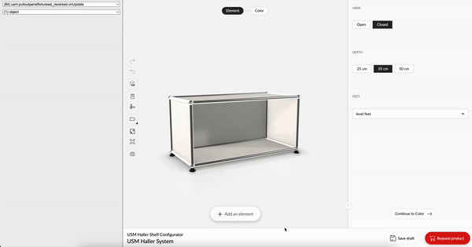

# Rubens Configurator debug client

[Debug client](https://roomle.github.io/rubens-configurator-debug-client/dist/client/)

Url parameters:

- `id`: configurator id (default: `usm:frame`)
- `serverUrl`: URL of the server (e.g. `https://www.roomle.com/t/cp/`) - **at the moment this only works with `https://www.roomle.com/t/bo-mvp/`**

